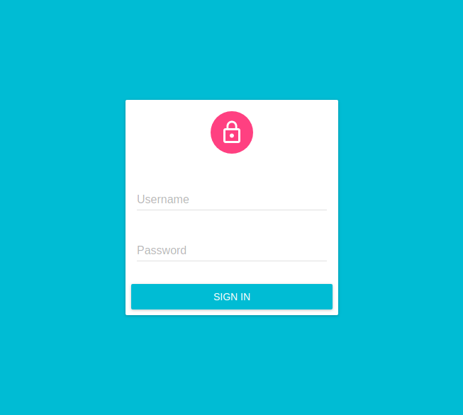
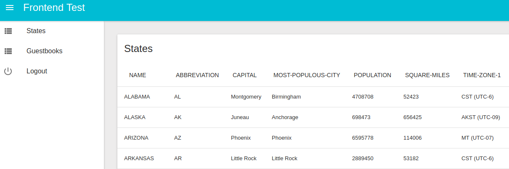
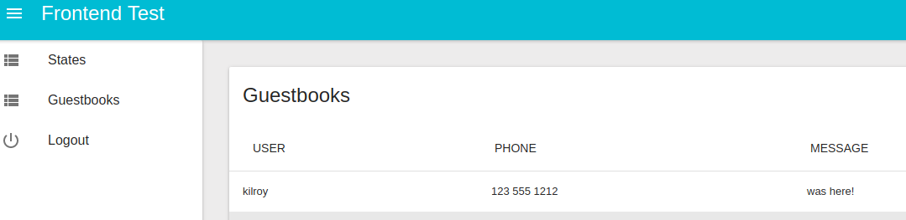

# Frontend Developer Test

## Login

## States

## Guestbooks

# Question and Answers

- What URL should be used to access your application?
  - Clone the Git repository and run `npm install` and `node server.js`. Then access `http://localhost:8888/`.

- What libraries did you use to write your application?
  - Node.js runtime environment, Admin on Rest (ReactJS and Material design for styling)

- What influenced the design of your user interface?
  - Google Material Design

- What steps did you take to make your applciation user friendly?
  - Used Google Material Design best practices comes with the kit; it is also responsive and touch friendly.

- What steps did you take to insure your application was secure?
  - Fixed the `server.js` script to use token; instead of cookie, as it didn't work client side Ajax.
  - Security of the app is still not good. We usually use oAuth based approach.

- What could be done to the front end or back end to make it more secure?
  - Rewrite REST API to make use of oAuth protocol or JWT token.
  - In the front end too, make use of oAuth specific approach or JWT token approach.

# License

Copyright (c) 2017 [Agriya](https://www.agriya.com/).